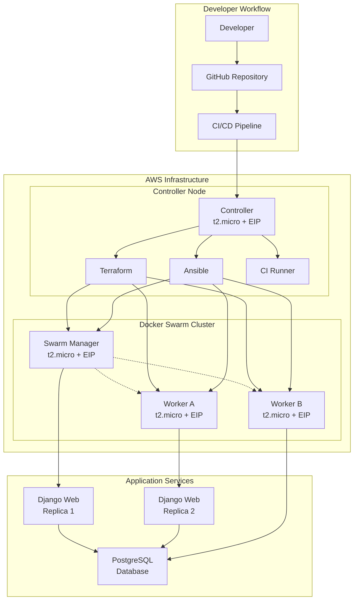

# Design Document

## Overview

This system implements a comprehensive DevOps automation pipeline for a Django-PostgreSQL web application deployed on AWS using Infrastructure as Code principles. The architecture follows a multi-tier approach with separate concerns for infrastructure provisioning (Terraform), configuration management (Ansible), container orchestration (Docker Swarm), and continuous deployment (CI/CD).

## Architecture

### High-Level Architecture



### Network Architecture

- **Public Access**: All EC2 instances have Elastic IPs for direct internet access
- **Swarm Overlay Network**: Internal container communication via Docker overlay networks
- **Security Groups**: Controlled access for HTTP (80), HTTPS (443), SSH (22), and Swarm ports (2377, 7946, 4789)
- **Service Discovery**: Containers communicate using Docker service names

## Components and Interfaces

### 1. Infrastructure Layer (Terraform)

**Purpose**: Provision and manage AWS resources declaratively

**Components**:
- `main.tf`: Primary infrastructure definition
- `variables.tf`: Input parameters and configuration
- `outputs.tf`: Export public IPs and resource identifiers
- `security.tf`: Security groups and access rules
- `keypair.tf`: SSH key generation and management

**Key Resources**:
- 4x EC2 instances (t2.micro, Ubuntu 20.04 LTS)
- 4x Elastic IP addresses
- Security groups with required port access
- Auto-generated SSH keypair with local PEM file storage

**Interfaces**:
```hcl
# Output interface for Ansible integration
output "controller_ip" { value = aws_eip.controller.public_ip }
output "manager_ip" { value = aws_eip.manager.public_ip }
output "worker_a_ip" { value = aws_eip.worker_a.public_ip }
output "worker_b_ip" { value = aws_eip.worker_b.public_ip }
```

### 2. Configuration Management Layer (Ansible)

**Purpose**: Configure servers and deploy Docker Swarm services

**Components**:
- `inventory/hosts.yml`: Dynamic inventory using Terraform outputs
- `playbooks/site.yml`: Main orchestration playbook
- `playbooks/docker-install.yml`: Docker installation and setup
- `playbooks/swarm-init.yml`: Swarm cluster initialization
- `playbooks/swarm-deploy.yml`: Application stack deployment
- `roles/`: Reusable configuration roles

**Key Playbooks**:
1. **Docker Installation**: Install Docker, Docker Compose, configure daemon
2. **Swarm Initialization**: Initialize manager, generate join tokens, join workers
3. **Stack Deployment**: Deploy docker-compose stack to Swarm cluster

**Interfaces**:
```yaml
# Inventory structure
all:
  children:
    controller:
      hosts:
        controller: { ansible_host: "{{ controller_ip }}" }
    swarm_managers:
      hosts:
        manager: { ansible_host: "{{ manager_ip }}" }
    swarm_workers:
      hosts:
        worker_a: { ansible_host: "{{ worker_a_ip }}" }
        worker_b: { ansible_host: "{{ worker_b_ip }}" }
```

### 3. Container Orchestration Layer (Docker Swarm)

**Purpose**: Orchestrate and scale containerized applications

**Components**:
- `docker/web/Dockerfile`: Django application container
- `docker/db/Dockerfile`: PostgreSQL container with initialization
- `docker-compose.yml`: Service definitions for Swarm deployment
- `docker/web/requirements.txt`: Python dependencies
- `docker/db/init.sql`: Database schema initialization

**Service Architecture**:
```yaml
services:
  web:
    image: django-app:latest
    replicas: 2
    ports:
      - "80:8000"
    networks:
      - app-network
    depends_on:
      - db
      
  db:
    image: postgres:13
    replicas: 1
    environment:
      POSTGRES_DB: postgres
      POSTGRES_USER: postgres
      POSTGRES_PASSWORD: postgres
    volumes:
      - db-data:/var/lib/postgresql/data
    networks:
      - app-network

networks:
  app-network:
    driver: overlay
    
volumes:
  db-data:
    driver: local
```

### 4. Application Layer (Django)

**Purpose**: Web application with user authentication

**Components**:
- `django_app/mysite/`: Django project configuration
- `django_app/accounts/`: Authentication app with models, views, templates
- `django_app/templates/`: HTML templates for login/register/home pages
- `django_app/static/`: CSS and static assets
- `django_app/requirements.txt`: Python dependencies

**Database Schema**:
```sql
CREATE TABLE login (
    id SERIAL PRIMARY KEY,
    username VARCHAR(50) UNIQUE NOT NULL,  -- Roll No (e.g., ITA700)
    password VARCHAR(100) NOT NULL         -- Admission No (e.g., 2022PE0000)
);
```

**URL Structure**:
- `/` → Redirect to login
- `/login/` → Login form
- `/register/` → Registration form  
- `/home/` → Authenticated home page
- `/logout/` → Logout and redirect to login

### 5. CI/CD Pipeline Layer

**Purpose**: Automate build, test, and deployment processes

**GitHub Actions Workflow**:
```yaml
name: Deploy to AWS
on:
  push:
    branches: [ main, ITA* ]
    
jobs:
  deploy:
    runs-on: ubuntu-latest
    steps:
      - uses: actions/checkout@v2
      - name: Configure AWS credentials
      - name: Build Docker images
      - name: Deploy to Swarm cluster
      - name: Run health checks
```

**Jenkins Pipeline** (Alternative):
```groovy
pipeline {
    agent any
    stages {
        stage('Checkout') { ... }
        stage('Build Images') { ... }
        stage('Deploy to Swarm') { ... }
        stage('Health Check') { ... }
    }
}
```

## Data Models

### Django Models

```python
# accounts/models.py
from django.db import models

class Login(models.Model):
    username = models.CharField(max_length=50, unique=True)  # Roll No
    password = models.CharField(max_length=100)             # Admission No
    created_at = models.DateTimeField(auto_now_add=True)
    
    class Meta:
        db_table = 'login'
```

### Database Configuration

```python
# settings.py
DATABASES = {
    'default': {
        'ENGINE': 'django.db.backends.postgresql',
        'NAME': 'postgres',
        'USER': 'postgres',
        'PASSWORD': 'postgres',
        'HOST': 'db',  # Docker service name
        'PORT': '5432',
    }
}
```

## Error Handling

### Infrastructure Level
- **Terraform State Management**: Remote state storage with locking
- **Resource Cleanup**: Proper destroy procedures and dependency management
- **Network Connectivity**: Health checks and retry mechanisms

### Application Level
- **Database Connection**: Connection pooling and retry logic
- **Authentication Failures**: Clear error messages and rate limiting
- **Container Health**: Health check endpoints and restart policies

### Deployment Level
- **Rolling Updates**: Zero-downtime deployments with health checks
- **Rollback Procedures**: Automated rollback on deployment failures
- **Service Discovery**: Graceful handling of service unavailability

## Testing Strategy

### Unit Testing
- Django model and view tests
- Database integration tests
- Authentication flow validation

### Integration Testing
- End-to-end Selenium tests for user workflows
- API endpoint testing
- Database connectivity validation

### Infrastructure Testing
- Terraform plan validation
- Ansible playbook syntax checking
- Docker image security scanning

### Deployment Testing
- Health check endpoints
- Load balancer functionality
- Service scaling validation

### Test Automation
```python
# selenium/test_user_flow.py
class UserFlowTest(unittest.TestCase):
    def test_register_login_home_logout(self):
        # Test complete user journey
        self.register_user("ITA700", "2022PE0000")
        self.login_user("ITA700", "2022PE0000")
        self.verify_home_page("Hello ITA700 How are you")
        self.logout_user()
```

## Security Considerations

### Infrastructure Security
- Security groups with minimal required access
- SSH key-based authentication only
- Regular security updates via Ansible

### Application Security
- Django security middleware enabled
- CSRF protection for forms
- Secure password handling (though simplified for assignment)
- Environment-based configuration management

### Container Security
- Non-root container users
- Minimal base images
- Regular image updates
- Secret management for database credentials

## Scalability and Performance

### Horizontal Scaling
- Web service replicas can be increased via Docker Swarm
- Worker nodes can be added to the Swarm cluster
- Database can be scaled with read replicas (future enhancement)

### Performance Optimization
- Static file serving via nginx (future enhancement)
- Database connection pooling
- Container resource limits and requests
- Load balancing across web service replicas

## Deployment Strategy

### Blue-Green Deployment
- Maintain two identical production environments
- Switch traffic between environments for zero-downtime updates
- Rollback capability by switching back to previous environment

### Rolling Updates
- Update services one replica at a time
- Health checks ensure service availability
- Automatic rollback on failure detection